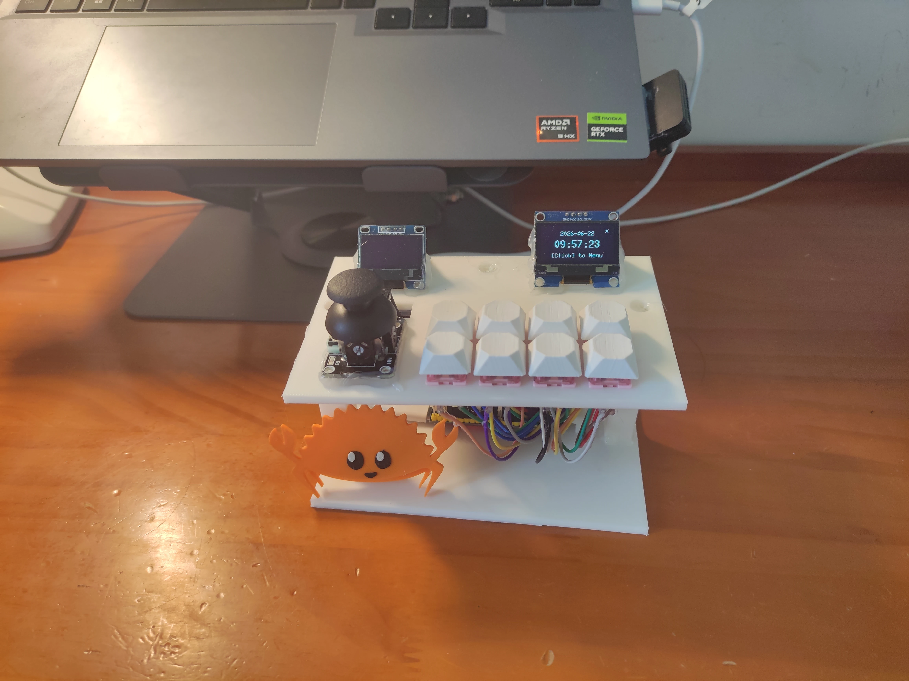

# Skid Clock v2

> [!IMPORTANT]
>
> 我们假设您拥有3D 打印机或者可以生产外壳。
>
> 如果没有可以用纸盒代替

还在为水课发愁吗? 试试这款桌面时钟, 有一个 ESP32-S3 就可以制作, 轻松跳过水课!

## 自己组装

### 原材料/工具

| 名称               | 数量     |
| ------------------ | -------- |
| ESP32s3            | 1        |
| 机械键盘轴         | 8        |
| 二极管             | 8        |
| 摇杆               | 1        |
| Sh1106 1.3″ 屏幕   | 1        |
| Ssd1306 0.96″ 屏幕 | 1        |
| DS1306 时钟模块    | 1        |
| 面包板             | 1        |
| 杜邦线             | ~45 根   |
| 3D打印机           | 1 (可选) |
| 热熔胶             | 1        |
| 电烙铁             | 1        |
| 镊子               | 1        |

### 制作外壳 (3D打印)

> 如果你要3D 打印键帽: [Printables](https://www.printables.com/model/399607-complete-cherry-mx-stem-keycap-set-optimized-for-3)

- 下载 FreeCAD
- 下载 [工程文件](./models/skid-clock.FCStd)
- 导出为 `.3mf` 或者 `.step`
- 用切片软件导出 GCode
- 发送到打印机, 打印!

### 制作外壳 (纸盒子)

- 在顶部开8个 14x14mm 口, 用于放机械键盘按键
- 放入机械键盘按键, 粘贴屏幕和摇杆即可

### 组装

> [!IMPORTANT]
> 先连接电路再粘贴顶板和底板!

- 放置两块屏幕, 用热熔胶粘到外壳的斜坡上
- 将8个轴卡到对应的卡槽中 (不需要热熔胶固定)
- 将杜邦线接到键盘轴上, 并用热熔胶固定 (需要拨开外壳, 使用镊子即可)
- 粘贴摇杆 (没有开槽, 多打一点热熔胶)
- 在顶盖背面粘贴 DS1306 时钟模块
- 将所有线连到 ESP32s3 上 ([引脚信息](#引脚信息))
- 将 ESP32s3 划入底板的卡槽中
- 确认接线无误, 用热熔胶粘贴底板上的三个柱子和顶盖

### 引脚信息

> 你可以在这里找到引脚定义代码 [main.rs](https://github.com/cubewhy/skid-clock-v2/blob/master/src/main.rs)

| GPIO | 说明            |
| ---- | --------------- |
| 4    | 键盘 row1       |
| 5    | 键盘 row2       |
| 6    | 键盘 col1       |
| 16   | 键盘 col2       |
| 15   | 键盘 col3       |
| 13   | 键盘 col4       |
| 9    | I2C SDA         |
| 8    | I2C SCL         |
| 10   | DS1306 CLK      |
| 11   | DS1306 DAT      |
| 12   | DS1306 RST      |
| 3    | 摇杆 VRX (X 轴) |
| 7    | 摇杆 VRY (Y 轴) |
| 18   | 摇杆中键        |

#### 搭建矩阵扫描电路

#### I2C 地址

> 你需要使用电烙铁焊接屏幕背后的焊点来切换地址

| 地址 | 说明            |
| ---- | --------------- |
| 0x3D | 1.3″ OLED 屏幕  |
| 0x3C | 0.96″ OLED 屏幕 |

## License

Licensed under GPL-3.0

You're allowed to use, share and modify
